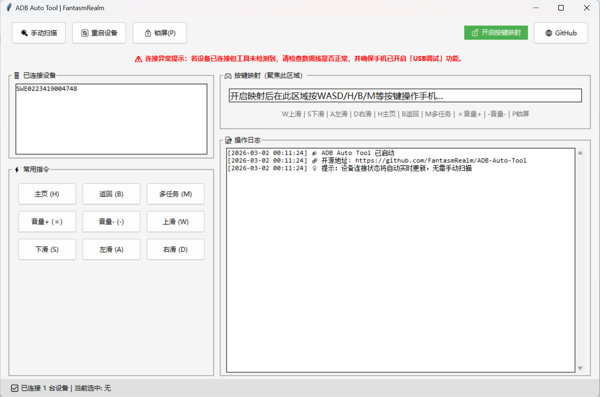

```markdown
# ADB Auto Tool
> 基于 ADB 指令集的轻量级 Android 设备自动化控制工具

[](https://github.com/FantasmRealm/ADB-Auto-Tool/stargazers)
[](https://github.com/FantasmRealm/ADB-Auto-Tool/blob/main/LICENSE)

---

## 📖 项目简介

**ADB Auto Tool** 是一个基于 Python 与 ADB（Android Debug Bridge）指令集开发的桌面自动化工具，它将复杂的 ADB 命令封装为直观的图形界面，让你无需记忆命令，即可对 Android 设备进行高效的模拟操作与管理。

核心功能：
- 📱 **实时设备检测**：自动扫描并实时更新已连接的 Android 设备状态
- 🎮 **键盘映射控制**：支持 WASD 滑屏、H/B/M 主页/返回/多任务等快捷操作
- ⚡ **常用指令面板**：一键执行音量调节、锁屏、重启等高频操作
- 📝 **操作日志记录**：完整记录所有执行指令与结果，便于排查问题

---

## 📂 项目文件说明

你在仓库中看到的文件和文件夹作用如下：

| 文件/文件夹 | 作用 |
|------------|------|
| `ADB-Auto-Tool.py` | 项目主程序 Python 脚本，所有核心功能都在这里 |
| `ADB_Auto_Tool.spec` | PyInstaller 打包配置文件，记录了打包参数和依赖 |
| `adb.exe`、`AdbWinApi.dll`、`AdbWinUsbApi.dll` | ADB 运行依赖文件，是工具能识别手机的关键 |
| `build/` | 打包过程中生成的临时构建文件，可安全删除，不影响使用 |
| `localpycs/` | 打包过程中生成的 Python 字节码缓存，可安全删除 |
| `dist/` | 打包输出目录，里面的 `ADB_Auto_Tool.exe` 就是最终可执行文件 |
| `PNG1.png` | 工具截图，用于 README 展示 |
| `README.md` | 项目说明文档，就是你现在看到的这个文件 |
| `许可证` | 项目开源许可证文件 |

> 注：日常使用时，只需保留 `dist/ADB_Auto_Tool.exe` 和三个 ADB 依赖文件即可，其他文件是开发和打包过程中产生的。

---

## 🖼️ 工具截图



---

## 🚀 快速开始

### 方式一：直接使用打包好的 exe（推荐）

1.  **获取可执行文件**
    从 `dist/` 文件夹中取出 `ADB_Auto_Tool.exe`，这是已经打包好的可执行文件。

2.  **准备 ADB 依赖**
    将 `adb.exe`、`AdbWinApi.dll`、`AdbWinUsbApi.dll` 三个文件复制到与 `ADB_Auto_Tool.exe` 同一目录下。

3.  **运行工具**
    双击 `ADB_Auto_Tool.exe` 即可启动。启动后，工具会自动检测连接的设备。

### 方式二：从源码运行

1.  **克隆项目**
    ```bash
    git clone https://github.com/FantasmRealm/ADB-Auto-Tool.git
    cd ADB-Auto-Tool
    ```

2.  **安装依赖**
    ```bash
    pip install adb-shell pycryptodome -i https://pypi.tuna.tsinghua.edu.cn/simple
    ```

3.  **运行脚本**
    ```bash
    python ADB-Auto-Tool.py
    ```

---

## 🛠️ 部署与打包（从源码生成 exe）

如果你想对代码进行修改并重新打包，可以按照以下步骤操作：

1.  **安装打包工具**
    ```bash
    pip install pyinstaller -i https://pypi.tuna.tsinghua.edu.cn/simple
    ```

2.  **执行打包命令**
    在项目根目录下，打开终端执行：
    ```bash
    pyinstaller -F -w -n "ADB_Auto_Tool" ADB-Auto-Tool.py
    ```
    - `-F`：打包成单个 exe 文件
    - `-w`：隐藏控制台窗口，仅显示图形界面
    - `-n "ADB_Auto_Tool"`：自定义生成的 exe 文件名

3.  **获取打包结果**
    打包完成后，在项目目录的 `dist` 文件夹中即可找到 `ADB_Auto_Tool.exe`。

---

## ❓ 常见问题 (FAQ)

### Q: 工具无法检测到我的设备怎么办？
A: 请按照以下步骤排查：
1.  确保手机已开启 **USB调试** 功能（在「开发者选项」中）。
2.  检查 USB 数据线是否正常，尝试更换数据线或 USB 端口。
3.  确认已将 `adb.exe`、`AdbWinApi.dll`、`AdbWinUsbApi.dll` 三个文件放在与 exe 同一目录。
4.  在命令行中手动执行 `adb devices`，查看是否能列出设备。

### Q: 双击 exe 后闪退怎么办？
A:
1.  检查是否将三个 ADB 依赖文件放在了 exe 同目录。
2.  尝试右键点击 exe，选择「以管理员身份运行」。
3.  暂时关闭杀毒软件，看是否被误拦截。
4.  如果仍有问题，可以去掉打包命令中的 `-w` 参数，重新打包后在控制台运行，查看具体报错信息。

### Q: 杀毒软件报毒怎么办？
A: 这是 PyInstaller 打包的常见现象，并非病毒。请将 `ADB_Auto_Tool.exe` 添加到杀毒软件的信任列表或白名单中。

---

## 📄 许可证

本项目基于 MIT 许可证开源，详见 [LICENSE](https://github.com/FantasmRealm/ADB-Auto-Tool/blob/main/LICENSE) 文件。

---

## 🤝 贡献

欢迎提交 Issue 和 Pull Request 来改进这个项目！
```
